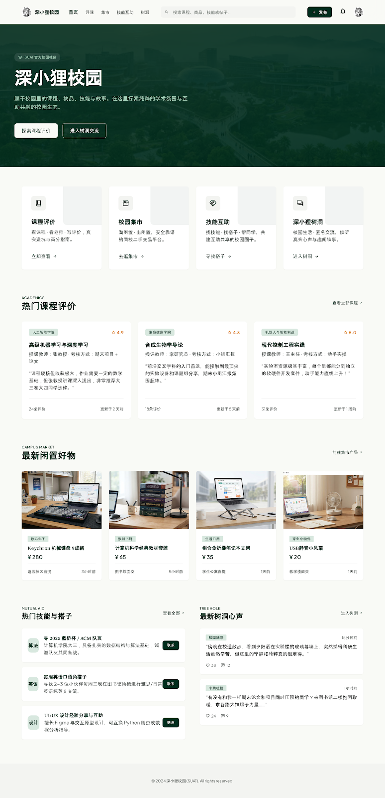

# 深小狸校园 · Shenxiaoli Platform

> 学生共建的非官方校园社区 — 服务于深圳先进大学（SUAT）的同学。
> 评课 · 集市 · 技能互助 · 树洞, in one place.

[](LICENSE)


[](CONTRIBUTING.md)



---

## ✨ About

**深小狸校园 (Shenxiaoli Campus)** 是一个 **学生共建** 的非官方校园社区,
围绕深圳先进大学（SUAT）同学的日常需求设计:

| Module                      | What it does                |
| --------------------------- | --------------------------- |
| 评课 / Course Evaluation    | 选课之前,先看看大家怎么说。 |
| 集市 / Market               | 校内闲置好物流转平台。      |
| 技能互助 / Skill Mutual Aid | 找搭子,互帮互助,共享知识。  |
| 树洞 / Tree Hole            | 匿名、克制、可控的心声墙。  |

> ⚠️ **非官方声明**: 本项目由学生自发维护,与深圳先进大学（SUAT）校方
> 无隶属关系。"深小狸校园" 是这个开源社区项目的名称,不代表学校的官方
> 立场。`SUAT` / `Shenzhen University of Advanced Technology` 在文案
> 中仅作为校园场景的语境说明。

当前仓库为 **前后端分离的 monorepo**: `frontend/` 已实现(数据来自静态
占位), `backend/` 为预留目录。后续接入真实后端时, UI 契约保持不变。

### Design language

The visual system is documented in [`docs/DESIGN.md`](docs/DESIGN.md) and
codified in [`frontend/tailwind.config.ts`](frontend/tailwind.config.ts) /
[`frontend/src/styles/tokens.css`](frontend/src/styles/tokens.css). It is
built around the **Deep Forest Emerald Academic** palette — deep forest
greens, off-white surfaces, serif headlines, and zero blue.

---

## 🚀 Tech stack

- **[Bun](https://bun.sh)** — package manager & script runner
- **[Vite](https://vitejs.dev)** — multi-page dev server & bundler
- **[Tailwind CSS](https://tailwindcss.com)** — utility-first styling with
  design tokens
- **[TypeScript](https://www.typescriptlang.org)** — strict, ESM-first
- **[ESLint](https://eslint.org) + [Prettier](https://prettier.io)** —
  formatting & linting

No framework lock-in. Each page is a plain HTML entry with shared chrome
pre-rendered by Vite before the first browser paint; see
[`docs/ARCHITECTURE.md`](docs/ARCHITECTURE.md) for the runtime model.

The backend is not implemented yet — see [`backend/README.md`](backend/README.md)
for the intended scope.

---

## 📁 Project layout

A two-package monorepo. Each package owns its own dependencies and lockfile;
there is no shared root `node_modules`.

```
.
├── .github/
│   ├── ISSUE_TEMPLATE/          # Issue templates
│   ├── workflows/ci.yml         # Quality checks on push and pull request
│   ├── workflows/deploy.yml     # Static deploy
│   ├── dependabot.yml           # Monthly dependency update checks
│   └── PULL_REQUEST_TEMPLATE.md # Pull request checklist
├── docs/
│   ├── ARCHITECTURE.md          # Runtime model and extension guide
│   ├── DESIGN.md                # Deep Forest Emerald Academic design system
│   └── screenshots/             # Reference renders of each page
├── frontend/                    # Bun + Vite + Tailwind multi-page client
│   ├── public/
│   │   └── favicon.svg          # Site favicon
│   ├── src/
│   │   ├── index.html              # 首页     / Home (Vite entry)
│   │   ├── course-evaluation.html  # 评课     / Course Evaluation (Vite entry)
│   │   ├── market.html             # 集市     / Market (Vite entry)
│   │   ├── skill-mutual-aid.html   # 技能互助 / Skill Mutual Aid (Vite entry)
│   │   ├── tree-hole.html          # 树洞     / Tree Hole (Vite entry)
│   │   ├── scripts/
│   │   │   ├── main.ts          # Client-only interaction wiring
│   │   │   └── layout.ts        # Header/footer template functions
│   │   └── styles/
│   │       ├── main.css         # Tailwind entry + project resets
│   │       └── tokens.css       # Design tokens as CSS custom properties
│   ├── .prettierrc.json
│   ├── .prettierignore
│   ├── eslint.config.js
│   ├── bunfig.toml
│   ├── tailwind.config.ts
│   ├── postcss.config.js
│   ├── tsconfig.json
│   ├── vite.config.ts
│   └── package.json             # @shenxiaoli/frontend
├── backend/                     # 🚧 Reserved — not implemented yet
│   └── README.md                # Intended scope and conventions
├── .editorconfig
├── .gitattributes
├── .gitignore
├── rth-host.json                # Static-host deploy target
├── package.json                 # Root: delegating scripts only, no deps
├── README.md
├── LICENSE
├── CONTRIBUTING.md
├── CHANGELOG.md
├── SECURITY.md
└── CODE_OF_CONDUCT.md
```

---

## 🛠️ Getting started

### Prerequisites

- [Bun](https://bun.sh) **>= 1.1** (`curl -fsSL https://bun.sh/install | bash`)
- A modern browser (Chrome / Edge / Firefox / Safari current)

### Install

```bash
bun run setup          # from the repo root — installs frontend/ deps
# or equivalently:
cd frontend && bun install
```

### Develop

```bash
bun run dev            # from the repo root, delegates into frontend/
```

The root `package.json` carries no dependencies — it only forwards `dev`,
`build`, `preview`, `lint`, `format:check`, and `typecheck` into `frontend/`.
Run them there directly if you prefer.

The dev server starts on <http://127.0.0.1:5173> and opens the Home page
automatically. Each page lives at:

- `/index.html` — Home
- `/course-evaluation.html` — 评课
- `/market.html` — 集市
- `/skill-mutual-aid.html` — 技能互助
- `/tree-hole.html` — 树洞

### Build for production

```bash
bun run build          # type-check + emit frontend/dist/
bun run preview        # serve the built output
```

### Lint / format / type-check

Run these from `frontend/` (the full set, including the `:fix` variants):

```bash
cd frontend
bun run lint           # ESLint
bun run lint:fix       # ESLint --fix
bun run format         # Prettier --write
bun run format:check   # Prettier --check (CI-friendly)
bun run typecheck      # tsc --noEmit
```

---

## 🧱 Adding a page

1. Drop a new HTML file into `frontend/src/`, e.g. `lost-and-found.html`.
2. Inside `<body>` place a `<div data-layout="header" data-active="lost-and-found"></div>`,
   then `<main>`, then `<div data-layout="footer"></div>`.
3. Register the entry in `frontend/vite.config.ts` under
   `build.rollupOptions.input`.
4. If it belongs in global navigation, add its `NavItem` to `NAV_ITEMS` in
   `frontend/src/scripts/layout.ts` and use that same key for `data-active`.

The shared header (with the active nav state), footer, and render-blocking
stylesheet are **pre-rendered into the HTML** by the
`shenxiaoli:inject-layout` plugin defined in `frontend/vite.config.ts`, so
there is no flash of unstyled chrome on first paint — the browser sees the
full page immediately.

---

## 🌍 Localization

UI copy is currently Chinese-only. To add another language:

1. Extract string literals into `frontend/src/scripts/i18n/<locale>.ts`.
2. Make `layout.ts` accept a `t()` function.
3. Document the workflow in `CONTRIBUTING.md`.

---

## 🤝 Contributing

We welcome issues, design feedback, and pull requests.
See [`CONTRIBUTING.md`](CONTRIBUTING.md) for the workflow and
[`CODE_OF_CONDUCT.md`](CODE_OF_CONDUCT.md) for community standards.

---

## 🔒 Security

Vulnerabilities should **not** be filed as public issues. Please follow
[`SECURITY.md`](SECURITY.md).

---

## 📜 License

[MIT](LICENSE) © 2026 Shenxiaoli Platform Contributors.

---

## 🙏 Acknowledgements

- 灵感来自 **SUAT — 深圳先进大学 / Shenzhen University of Advanced
  Technology** 的校园文化。本项目由学生自发维护,与校方无关。
- Design system adapted from the **Deep Forest Emerald Academic** palette.
- Built with open-source tooling: Bun, Vite, Tailwind CSS, TypeScript.
